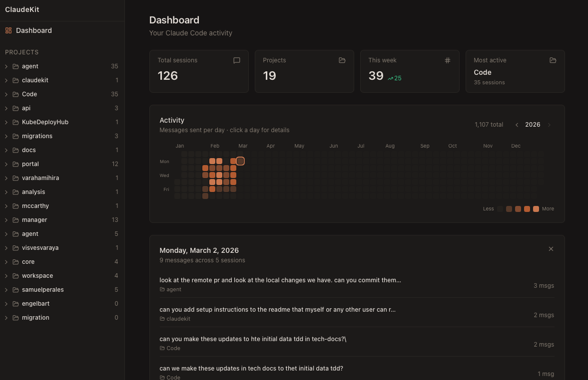
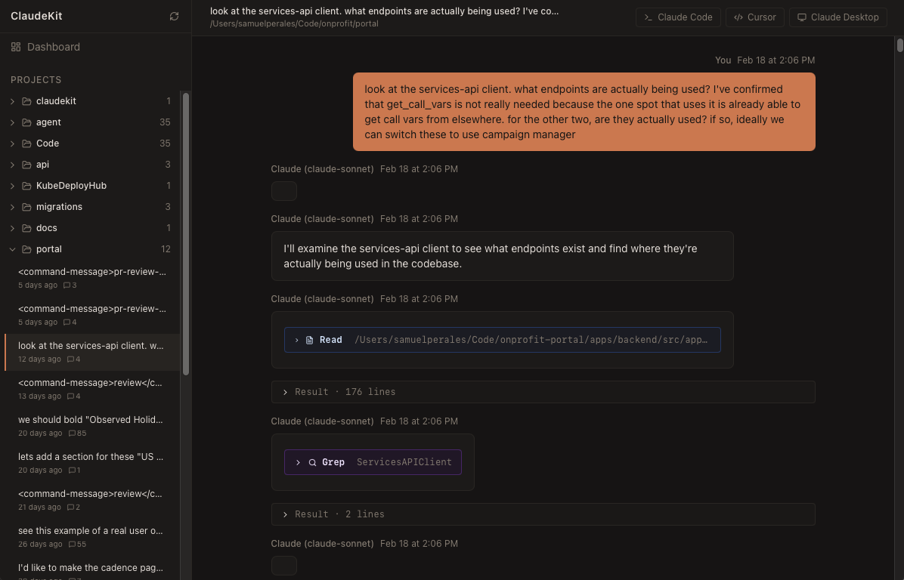

# ClaudeKit

A polished, open-source desktop app that supercharges how developers interact with Claude Code.

ClaudeKit unifies session history browsing, real-time prompt quality feedback, AI-powered prompt rewriting, token/cost tracking, and raw session introspection into a single installable app.

## Screenshots

### Dashboard


### Session Browser


## How It Works

ClaudeKit integrates seamlessly with Claude Code by reading your local session data:

1. **Session Discovery** — The app indexes `~/.claude/projects/` where Claude Code stores all your conversations. Each subdirectory represents a project, and each `.jsonl` file within is a session.

2. **Local Storage** — Session metadata and messages are indexed into a local SQLite database at `~/.claudekit/db.sqlite` for fast searching and browsing.

3. **Chat Rendering** — Messages are beautifully rendered using [react-markdown](https://github.com/remarkjs/react-markdown) with syntax highlighting for code blocks via [rehype-highlight](https://github.com/rehypejs/rehype-highlight).

4. **Resume Sessions** — Click any session to resume it in Claude Code with `claude --resume <session-id>`, automatically opening your terminal in the correct project directory.

All data stays local on your machine — no cloud services, no telemetry, just fast access to your Claude Code history.

## Features (Planned)

- **Session Browser** — Browse all your Claude Code sessions with syntax highlighting and full-text search
- **Insights Engine** — AI-powered analysis of your session history with actionable suggestions
- **Real-Time Prompt Feedback** — Live prompt quality scoring via Claude Code hook integration
- **Prompt Optimizer** — Rewrite any prompt using Claude Opus with extended thinking
- **Token Tracker & Raw Inspector** — Usage dashboards and full HTTP-level session inspection

## Tech Stack

- [Tauri v2](https://tauri.app/) — Rust backend + React/TypeScript frontend
- SQLite (via `rusqlite`) — Local session indexing
- React + Vite + shadcn/ui + Tailwind — UI
- Anthropic API — AI-powered features (user provides their own key)

## Status

Early development. See [`docs/PRD.md`](docs/PRD.md) for the full product requirements document.

## Setup

### Prerequisites

#### 1. Install Rust

```bash
curl --proto '=https' --tlsv1.2 -sSf https://sh.rustup.rs | sh
```

After installation, restart your terminal or run:
```bash
source $HOME/.cargo/env
```

#### 2. Install Node.js or Bun

**Option A: Node.js (v18 or later)**
- Download from [nodejs.org](https://nodejs.org/)
- Or use a version manager like [nvm](https://github.com/nvm-sh/nvm)

**Option B: Bun (recommended, faster)**
```bash
curl -fsSL https://bun.sh/install | bash
```

#### 3. Install Tauri System Dependencies

**macOS:**
```bash
xcode-select --install
```

**Linux (Debian/Ubuntu):**
```bash
sudo apt update
sudo apt install libwebkit2gtk-4.1-dev \
  build-essential \
  curl \
  wget \
  file \
  libssl-dev \
  libgtk-3-dev \
  libayatana-appindicator3-dev \
  librsvg2-dev
```

**Linux (Fedora):**
```bash
sudo dnf install webkit2gtk4.1-devel \
  openssl-devel \
  curl \
  wget \
  file \
  gcc-c++ \
  gtk3-devel \
  libappindicator-gtk3-devel \
  librsvg2-devel
```

**Windows:**
- Install [Microsoft Visual Studio C++ Build Tools](https://visualstudio.microsoft.com/visual-cpp-build-tools/)
- Install [WebView2](https://developer.microsoft.com/en-us/microsoft-edge/webview2/#download-section)

### Installation

1. Clone the repository:
```bash
git clone https://github.com/yourusername/claudekit.git
cd claudekit
```

2. Install frontend dependencies:
```bash
# If using bun (recommended)
bun install

# If using npm
npm install
```

3. Run the development server:
```bash
# If using bun
bun tauri dev

# If using npm
npm run tauri dev
```

The app will launch in development mode with hot-reload enabled for both the frontend and backend.

### Building for Production

To create an optimized production build:

```bash
# If using bun
bun tauri build

# If using npm
npm run tauri build
```

The built application will be in `src-tauri/target/release/bundle/`.

## Development Phases

| Phase | Feature | Status |
|-------|---------|--------|
| 1 | Session Browser | Planned |
| 2 | Insights Engine | Planned |
| 3 | Real-Time Prompt Feedback | Planned |
| 4 | Prompt Optimizer | Planned |
| 5 | Token Tracker & Raw Inspector | Planned |

## Philosophy

- **Local-first** — No cloud, no telemetry, no third-party servers
- **Your API key** — All AI features use your own Anthropic account
- **Fast** — SQLite indexing keeps the session browser snappy even with thousands of sessions
- **Open source** — Pre-built binaries on GitHub Releases, source always available

## License

MIT
